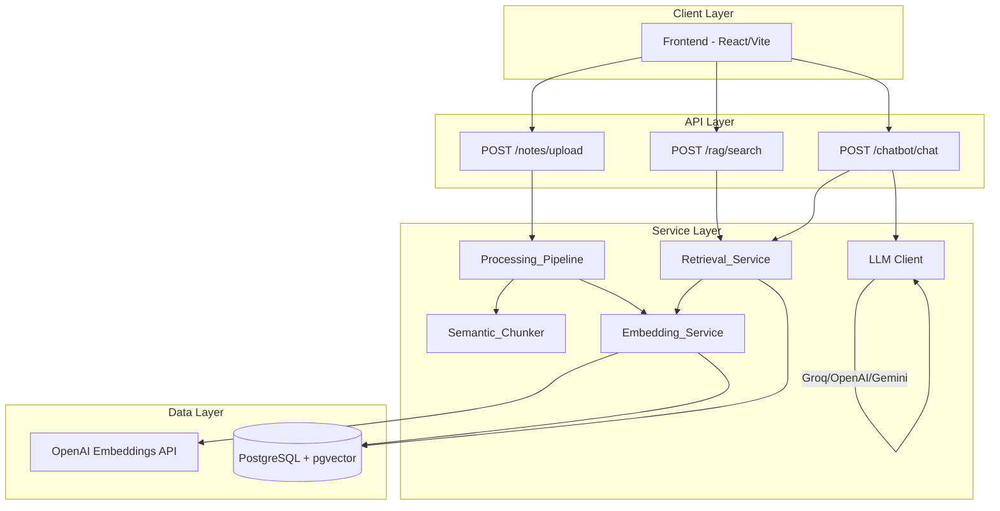
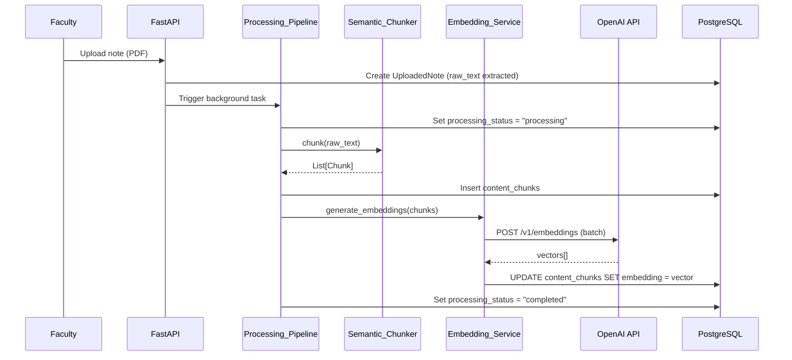
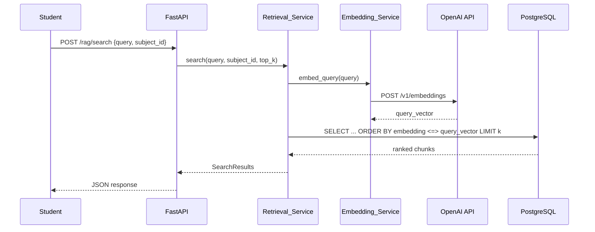

# Design Document: RAG Notes Pipeline

## Overview

The RAG Notes Pipeline adds semantic search and context-aware AI responses to IntelliLearn by building a vector-based retrieval system on top of the existing PostgreSQL database (Neon DB). The pipeline processes uploaded course notes through semantic chunking, generates vector embeddings via OpenAI's `text-embedding-3-small` model, stores them using the pgvector extension, and exposes retrieval endpoints for both standalone search and LLM-augmented chatbot responses.

### Key Design Decisions

1. **pgvector over external vector DB**: Keeps the stack simple — single PostgreSQL instance with Neon DB handles both relational and vector data. No additional infrastructure (Pinecone, Weaviate, etc.) needed.
2. **Extend existing `content_chunks` table**: Rather than creating a new table, we add embedding and metadata columns to the existing `ContentChunk` model for cohesion with current data.
3. **Background processing via FastAPI BackgroundTasks**: Lightweight approach without requiring Celery/Redis. Suitable for the current scale (college LMS).
4. **Multi-provider LLM with single embedding provider**: Embeddings use OpenAI exclusively (consistency required for cosine similarity), while chat responses continue using the Groq→OpenAI→Gemini fallback chain.

## Architecture



### Data Flow: Note Upload → Searchable Chunks



### Data Flow: Semantic Search Query



## Components and Interfaces

### 1. Semantic_Chunker (`backend/utils/semantic_chunker.py`)

```python
class SemanticChunker:
    """Splits extracted note text into semantically coherent chunks."""

    def __init__(self, min_tokens: int = 200, max_tokens: int = 800, overlap_tokens: int = 50):
        ...

    def chunk(self, raw_text: str, note_title: str = "") -> list[ChunkResult]:
        """
        Split raw_text into chunks respecting:
        - Unit boundaries as primary split points
        - Sentence boundaries within token limits
        - Overlap between consecutive chunks
        """
        ...

    def _split_by_units(self, text: str) -> list[UnitSection]:
        """Detect unit headers and split text into sections."""
        ...

    def _split_section_into_chunks(self, section: UnitSection) -> list[ChunkResult]:
        """Token-based splitting within a unit section at sentence boundaries."""
        ...
```

**ChunkResult dataclass:**
```python
@dataclass
class ChunkResult:
    chunk_text: str
    chunk_index: int
    topic_hint: str          # max 200 chars, from nearest heading
    token_count: int
```

### 2. Embedding_Service (`backend/utils/embedding_service.py`)

```python
class EmbeddingService:
    """Generates and manages vector embeddings using OpenAI API."""

    def __init__(self, model: str = None, dimension: int = None):
        # Reads from env: EMBEDDING_MODEL, EMBEDDING_DIMENSION, OPENAI_API_KEY
        ...

    async def generate_embeddings(self, texts: list[str]) -> list[Optional[list[float]]]:
        """
        Generate embeddings for a batch of texts (up to 100 per call).
        Returns None for texts that exceed token limit or fail.
        Normalizes all vectors to unit length.
        """
        ...

    async def embed_query(self, query: str) -> list[float]:
        """Generate a single embedding for a search query."""
        ...

    def _normalize_vector(self, vector: list[float]) -> list[float]:
        """Normalize vector to unit length (L2 norm = 1.0)."""
        ...

    @property
    def is_available(self) -> bool:
        """Check if embedding service has a valid API key configured."""
        ...
```

### 3. Retrieval_Service (`backend/utils/retrieval_service.py`)

```python
class RetrievalService:
    """Performs cosine similarity search against the chunk store."""

    def __init__(self, embedding_service: EmbeddingService):
        ...

    async def search(
        self,
        query: str,
        subject_id: Optional[UUID] = None,
        top_k: int = 5,
        similarity_threshold: float = 0.7,
        offset: int = 0,
        limit: int = 5,
        db: Session = None,
    ) -> SearchResult:
        """
        1. Generate query embedding
        2. Execute pgvector cosine similarity query
        3. Filter by subject_id and threshold
        4. Return ranked results with metadata
        """
        ...
```

**SearchResult dataclass:**
```python
@dataclass
class ChunkSearchResult:
    chunk_text: str
    similarity_score: float    # rounded to 4 decimal places
    note_title: str
    unit: str
    topic_hint: str
    chunk_index: int

@dataclass
class SearchResult:
    results: list[ChunkSearchResult]
    total: int
    message: Optional[str] = None   # e.g., "No relevant content found"
```

### 4. Processing_Pipeline (`backend/utils/processing_pipeline.py`)

```python
class ProcessingPipeline:
    """Orchestrates the chunking → embedding pipeline as a background task."""

    TIMEOUT_SECONDS = 300
    MAX_RETRIES = 3

    def __init__(self, chunker: SemanticChunker, embedding_service: EmbeddingService):
        ...

    async def process_note(self, note_id: UUID, raw_text: str):
        """
        Full pipeline execution:
        1. Set status to "processing"
        2. Run semantic chunking
        3. Store chunks in content_chunks
        4. Generate embeddings in batches
        5. Store embeddings
        6. Set status to "completed" or "failed"
        """
        ...

    async def reprocess_note(self, note_id: UUID, new_raw_text: str):
        """Delete existing chunks and re-run pipeline for updated content."""
        ...
```

### 5. RAG Router (`backend/routers/rag.py`)

```python
router = APIRouter(prefix="/rag", tags=["RAG Search"])

@router.post("/search", response_model=SearchResponse)
async def semantic_search(
    body: SearchRequest,
    current_user: User = Depends(require_student),
    db: Session = Depends(get_db),
):
    """Standalone semantic search endpoint."""
    ...
```

### 6. Enhanced Chatbot Integration

The existing `chatbot.py` router's `/chat` endpoint will be extended to:
1. Call `RetrievalService.search()` with the student's message and subject context
2. Inject retrieved chunks into the system prompt as grounding context
3. Add citation instructions to the prompt
4. Include a `citations` field in the response

## Data Models

### Extended `content_chunks` Table

```sql
-- Alembic migration: add pgvector support and new columns
CREATE EXTENSION IF NOT EXISTS vector;

ALTER TABLE content_chunks
    ADD COLUMN embedding vector(1536),
    ADD COLUMN note_id UUID REFERENCES uploaded_notes(id) ON DELETE CASCADE,
    ADD COLUMN processing_status VARCHAR(20) DEFAULT 'pending';

-- HNSW index for cosine similarity search
CREATE INDEX idx_content_chunks_embedding_hnsw
    ON content_chunks
    USING hnsw (embedding vector_cosine_ops)
    WITH (m = 16, ef_construction = 64);

-- Index for filtering by note_id
CREATE INDEX idx_content_chunks_note_id ON content_chunks(note_id);
```

### Extended `uploaded_notes` Table

```sql
ALTER TABLE uploaded_notes
    ADD COLUMN processing_status VARCHAR(20) DEFAULT 'pending',
    ADD COLUMN processing_error JSONB,
    ADD COLUMN processed_at TIMESTAMP WITH TIME ZONE;
```

### Updated SQLAlchemy Models

**ContentChunk model (updated):**
```python
from pgvector.sqlalchemy import Vector

class ContentChunk(Base):
    __tablename__ = "content_chunks"

    id = Column(UUID(as_uuid=True), primary_key=True, default=uuid.uuid4, index=True)
    subject_id = Column(UUID(as_uuid=True), ForeignKey("subjects.id", ondelete="CASCADE"), nullable=False, index=True)
    note_id = Column(UUID(as_uuid=True), ForeignKey("uploaded_notes.id", ondelete="CASCADE"), nullable=True, index=True)
    chunk_text = Column(Text, nullable=False)
    topic_hint = Column(String(200), nullable=True)
    source_file = Column(String(255), nullable=True)
    chunk_index = Column(Integer, default=0)
    embedding = Column(Vector(1536), nullable=True)
    processing_status = Column(String(20), default="pending")  # pending, completed, failed
    created_at = Column(DateTime(timezone=True), server_default=func.now())

    # Relationships
    subject = relationship("Subject", back_populates="content_chunks")
    note = relationship("UploadedNote", back_populates="chunks")
```

**UploadedNote model (updated):**
```python
class UploadedNote(Base):
    __tablename__ = "uploaded_notes"

    # ... existing columns ...
    processing_status = Column(String(20), default="pending")  # pending, processing, completed, failed
    processing_error = Column(JSONB, nullable=True)  # {step, error, timestamp}
    processed_at = Column(DateTime(timezone=True), nullable=True)

    # New relationship
    chunks = relationship("ContentChunk", back_populates="note", cascade="all, delete-orphan")
```

### Configuration Model Extension

```python
class Settings(BaseSettings):
    # ... existing fields ...
    embedding_model: str = "text-embedding-3-small"
    embedding_dimension: int = 1536

    @field_validator("embedding_dimension")
    @classmethod
    def validate_dimension(cls, v):
        if not (1 <= v <= 4096):
            raise ValueError("EMBEDDING_DIMENSION must be between 1 and 4096")
        return v
```

### API Request/Response Schemas

```python
class SearchRequest(BaseModel):
    query: str = Field(..., min_length=1, max_length=1000)
    subject_id: Optional[UUID] = None
    top_k: int = Field(default=5, ge=1, le=20)
    similarity_threshold: float = Field(default=0.7, ge=0.0, le=1.0)
    offset: int = Field(default=0, ge=0)
    limit: int = Field(default=5, ge=1, le=20)

class ChunkResultResponse(BaseModel):
    chunk_text: str
    similarity_score: float
    note_title: str
    unit: str
    topic_hint: str
    chunk_index: int

class SearchResponse(BaseModel):
    results: list[ChunkResultResponse]
    total: int
    message: Optional[str] = None

class ChatResponseWithCitations(ChatResponse):
    citations: Optional[list[CitationItem]] = None

class CitationItem(BaseModel):
    note_title: str
    unit: str
```


## Correctness Properties

*A property is a characteristic or behavior that should hold true across all valid executions of a system — essentially, a formal statement about what the system should do. Properties serve as the bridge between human-readable specifications and machine-verifiable correctness guarantees.*

### Property 1: Chunk token count invariant

*For any* input text with more than 200 whitespace-separated tokens, every chunk produced by the Semantic_Chunker SHALL contain between 200 and 800 tokens (inclusive), except when a single sentence exceeds 800 tokens (in which case it forms its own chunk).

**Validates: Requirements 2.1, 2.3**

### Property 2: Sentence boundary termination

*For any* chunk produced by the Semantic_Chunker (excluding single-sentence oversized chunks), the chunk text SHALL end at a sentence boundary — defined as a period, question mark, or exclamation mark followed by the end of the string or whitespace.

**Validates: Requirements 2.2**

### Property 3: Consecutive chunk overlap

*For any* two consecutive chunks produced from the same unit section, the trailing 50 to 100 tokens of the first chunk SHALL appear as the leading tokens of the second chunk.

**Validates: Requirements 2.4**

### Property 4: Unit boundary integrity

*For any* input text containing unit headers (e.g., "Unit 1", "Unit II"), no chunk produced by the Semantic_Chunker SHALL contain text from two different unit sections.

**Validates: Requirements 2.5**

### Property 5: Chunk metadata invariants

*For any* chunk produced by the Semantic_Chunker, the `topic_hint` field SHALL have a length between 1 and 200 characters, and for any ordered set of chunks from a single note, the `chunk_index` values SHALL form a zero-based consecutive sequence (0, 1, 2, ..., n-1).

**Validates: Requirements 2.6, 2.8**

### Property 6: Short text single-chunk preservation

*For any* input text with 200 tokens or fewer, the Semantic_Chunker SHALL produce exactly one chunk whose text content equals the input text (identity transformation).

**Validates: Requirements 2.9**

### Property 7: Embedding batch size constraint

*For any* set of N chunks submitted to the Embedding_Service, the service SHALL make ceil(N / 100) API calls, where no single call contains more than 100 chunk texts.

**Validates: Requirements 3.2**

### Property 8: Vector normalization

*For any* embedding vector produced by the Embedding_Service, the L2 norm of the vector SHALL equal 1.0 within a tolerance of ±0.0001.

**Validates: Requirements 3.6**

### Property 9: Pipeline idempotency

*For any* input raw_text string, running the Semantic_Chunker twice on the same input SHALL produce an identical set of chunks — same count, same text content, and same ordering.

**Validates: Requirements 4.7**

### Property 10: Retrieval result filtering

*For any* search query with a specified `subject_id` and `similarity_threshold`, every chunk in the returned results SHALL belong to the specified subject AND have a cosine similarity score greater than or equal to the threshold.

**Validates: Requirements 5.3, 5.4**

### Property 11: Retrieval result ordering and cardinality

*For any* search query with parameter `top_k`, the returned results SHALL contain at most `top_k` chunks, and the results SHALL be ordered by descending cosine similarity score.

**Validates: Requirements 5.2**

### Property 12: Query length validation

*For any* query string that is empty (length 0) or exceeds 1000 characters, the Retrieval_Service SHALL reject the request with a validation error and return no results.

**Validates: Requirements 5.7**

### Property 13: RAG context injection constraints

*For any* set of retrieved chunks passed to the RAG_Chatbot, only chunks with similarity score >= 0.75 SHALL be injected into the LLM prompt, the number of injected chunks SHALL not exceed 5, and the total token count of injected context SHALL not exceed 3000.

**Validates: Requirements 6.2, 6.7**

### Property 14: Enrollment-based access control

*For any* authenticated student making a search request, the returned results SHALL only contain chunks from subjects in which the student is currently enrolled.

**Validates: Requirements 7.3**

## Error Handling

### Retry Strategy

| Component | Max Retries | Backoff | Failure Action |
|-----------|-------------|---------|----------------|
| Embedding_Service (batch) | 3 | Exponential (1s, 2s, 4s) | Mark chunks as "failed" |
| Processing_Pipeline (per step) | 3 | Exponential (1s, 2s, 4s) | Set note status to "failed" with error detail |
| Retrieval_Service (query embed) | 3 | Exponential (1s, 2s, 4s) | Return error response |
| RAG_Chatbot (retrieval call) | 0 (timeout only) | N/A | Fall back to general chatbot |

### Error Detail Schema

```python
# Stored in uploaded_notes.processing_error (JSONB)
{
    "step": "embedding_generation",  # or "chunking", "storage"
    "error": "OpenAI API rate limit exceeded",
    "timestamp": "2024-01-15T10:30:00Z",
    "retry_count": 3
}
```

### Graceful Degradation

1. **Embedding API unavailable**: Pipeline marks note as "failed". Students can still access notes normally; semantic search won't include those notes until re-processed.
2. **Retrieval_Service timeout (>5s)**: Chatbot falls back to general-knowledge mode. No error surfaced to student.
3. **pgvector extension missing**: Pipeline raises clear error at startup; embedding operations are disabled. Existing CRUD operations continue normally.
4. **OPENAI_API_KEY missing**: Logs warning at startup. Embedding operations disabled. All other features continue working.

### Timeout Handling

- **Processing_Pipeline**: 300-second hard timeout per note. Uses `asyncio.wait_for()` to enforce.
- **RAG_Chatbot retrieval**: 5-second timeout on the retrieval call. Uses `asyncio.wait_for()`.
- **Search endpoint**: 2-second target. Achieved via HNSW index + connection pool tuning.

## Testing Strategy

### Property-Based Tests (fast-check with Hypothesis for Python)

The feature uses **Hypothesis** (Python PBT library) for property-based testing. Each property test runs a minimum of 100 iterations with randomized inputs.

**Library**: `hypothesis` (Python)
**Configuration**: `@settings(max_examples=100)`

Properties to test:
- **Semantic_Chunker**: Properties 1-6, 9 (pure function, ideal for PBT)
- **Embedding_Service**: Properties 7, 8 (testable with mocks)
- **Retrieval_Service**: Properties 10, 11, 12 (testable with in-memory DB or mocks)
- **RAG Integration**: Property 13 (testable with mocked retrieval)
- **Access Control**: Property 14 (testable with test DB fixtures)

Each test is tagged:
```python
# Feature: rag-notes-pipeline, Property 1: Chunk token count invariant
@given(text=st.text(min_size=201, alphabet=st.characters(whitelist_categories=('L', 'Zs'))))
def test_chunk_token_count_invariant(text):
    ...
```

### Unit Tests (pytest)

- Semantic_Chunker edge cases: empty input, single sentence > 800 tokens, no unit headers
- Embedding_Service: mock API responses, retry behavior, oversized chunk handling
- Configuration validation: invalid dimensions, missing keys
- Pipeline state transitions: pending → processing → completed/failed

### Integration Tests (pytest + test database)

- End-to-end pipeline: upload note → chunks created → embeddings stored
- Search endpoint: authenticated request → correct results returned
- Chatbot RAG integration: message with subject → retrieval → cited response
- Authorization: enrollment-based filtering, 403 on non-enrolled subjects
- Cascade deletion: delete note → chunks removed

### Alembic Migration Strategy

1. **Migration 1**: Enable pgvector extension (`CREATE EXTENSION IF NOT EXISTS vector`)
2. **Migration 2**: Add columns to `content_chunks` (embedding, note_id, processing_status)
3. **Migration 3**: Add columns to `uploaded_notes` (processing_status, processing_error, processed_at)
4. **Migration 4**: Create HNSW index on embedding column

Migrations are separated to allow partial rollback and to handle the pgvector extension dependency cleanly. The extension creation requires superuser privileges on Neon DB (available via dashboard).

### Dependencies to Add

```
pgvector==0.2.5
hypothesis==6.98.0
numpy==1.26.4
```
