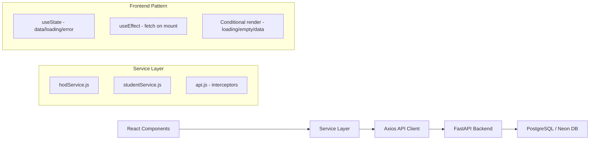

# Design Document: Remove Dummy Data

## Overview

This design describes the systematic removal of all hardcoded/mock data arrays from frontend components and their replacement with live API calls to the existing FastAPI backend. The project already has a functioning backend with full analytics, faculty, and student endpoints, and most analytics tab components have already been migrated to use `hodService`. The remaining work targets six specific locations where mock data persists.

**Key Principle:** No new backend endpoints are needed. All required data is already served by existing API routes. The work is purely frontend refactoring.

### Scope of Changes

| File | Action | Mock Data to Remove |
|------|--------|---------------------|
| `ManageFacultyPage.jsx` | Remove mock arrays, rely on existing `syncBackend()` | `INITIAL_FACULTY`, `INITIAL_UNASSIGNED`, `INITIAL_LEAVES` |
| `analyticsData.js` | Remove mock data exports, keep utilities | `HEATMAP_DATA`, `MISSED_QUESTIONS`, `DEPT_SUMMARY`, `SCORE_TREND`, `STUDENT_LIST`, `FACULTY_LIST`, `COMPARATIVE_DATA`, `SCORE_DISTRIBUTION` |
| `StudentHome.jsx` | Replace hardcoded stats/chart with API data | `performanceData`, `stats` |
| `ProgressPage.jsx` | Remove hardcoded radar/fallback arrays | `radarData`, `chartSubjects` fallback |
| `CreateAnnouncementModal.jsx` | Fetch dropdown options from API | `SUBJECT_OPTIONS`, `FACULTY_OPTIONS`, hardcoded counts in `getRecipientCount` |
| `AttendanceTab.jsx` | Simplify to permanent empty state | `DATA_AVAILABLE` flag, `Math.random()` calculations, mock tables |

---

## Architecture

The existing architecture already supports this change:



**Data flow pattern (already established in the project):**
1. Component mounts → `useEffect` triggers service call
2. Service layer calls `api.get(endpoint)` → returns `response.data`
3. Component manages `loading`, `data`, and `error` state
4. Render: loading skeleton → empty state (if no data) → data view

---

## Components and Interfaces

### 1. ManageFacultyPage.jsx

**Current State:** Has `INITIAL_FACULTY`, `INITIAL_UNASSIGNED`, `INITIAL_LEAVES` arrays declared as constants at the top of the file. However, the component already has a `syncBackend()` function that fetches from the real API and populates state. The mock arrays are dead code that are never used in the current flow.

**Changes:**
- DELETE: Remove the three `const INITIAL_FACULTY = [...]`, `const INITIAL_UNASSIGNED = [...]`, `const INITIAL_LEAVES = [...]` declarations (~200 lines)
- MODIFY: Set `loading` initial state to `true` (currently `false`)
- ADD: Empty state components for each section (faculty list, unassigned subjects, leave requests)
- ADD: Error toast in the `catch` block of `syncBackend()` (currently only `console.error`)

**API Endpoints Used (existing):**
- `GET /api/v1/hod/faculty/all` → faculty list
- `GET /api/v1/hod/faculty/unassigned-subjects` → unassigned subjects
- `GET /api/v1/hod/leave/pending` → pending leave requests

### 2. analyticsData.js

**Current State:** Exports both mock data arrays AND utility functions/config.

**Changes:**
- DELETE: Remove exports: `HEATMAP_DATA`, `MISSED_QUESTIONS`, `DEPT_SUMMARY`, `SCORE_TREND`, `STUDENT_LIST`, `FACULTY_LIST`, `COMPARATIVE_DATA`, `SCORE_DISTRIBUTION`
- KEEP: `DEPARTMENTS`, `DEPT_CONFIG`, `getHeatColor`, `calcAvg` (these are configuration/utilities, not mock data)
- VERIFY: No analytics tab components still import the removed exports (they already use `hodService`)

**Note:** The analytics tab components (`PerformanceHeatmap.jsx`, `StudentProgress.jsx`, `FacultyAnalytics.jsx`, `ComparativeReport.jsx`, `AnalyticsOverview.jsx`) already use `hodService` for live data. The mock arrays in `analyticsData.js` are dead exports that nothing imports anymore except potentially `AttendanceTab.jsx` (which imports `DEPT_SUMMARY`).

### 3. StudentHome.jsx

**Current State:** Has a hardcoded `performanceData` array and `stats` array used for the performance chart and stats cards.

**Changes:**
- DELETE: Remove `const performanceData = [...]` array
- DELETE: Remove `const stats = [...]` array
- ADD: Fetch student overview on mount via `studentService.getOverview()`
- ADD: Derive `performanceData` from `overview.subjects_studied`
- ADD: Derive `stats` from overview fields (`total_quizzes`, `average_score`, `doubts_asked`, `days_active`)
- ADD: Empty state for performance chart when no subject data exists
- MODIFY: Add overview fetch to existing `useEffect` (alongside timetable/events)

**API Endpoint Used (existing):**
- `GET /analytics/student/overview` → returns `{ subjects_studied, total_quizzes, average_score, ... }`

**Data Mapping:**
```javascript
// performanceData derived from API response
const performanceData = overview?.subjects_studied?.map(s => ({
  subject: s.subject_name.substring(0, 10),
  score: s.avg_score
})) || []

// stats derived from API response  
const stats = [
  { label: "Quizzes Taken", value: String(overview?.total_quizzes || 0) },
  { label: "Avg Score", value: `${overview?.average_score || 0}%` },
  { label: "Doubts Asked", value: String(overview?.doubts_asked || 0) },
  { label: "Days Active", value: String(overview?.days_active || 0) }
]
```

### 4. ProgressPage.jsx

**Current State:** Has a hardcoded `radarData` array and a fallback array in the `chartSubjects` assignment (`|| [...]`).

**Changes:**
- DELETE: Remove the entire hardcoded `radarData = [...]` array
- ADD: Derive `radarData` from `overview.subjects_studied`:
  ```javascript
  const radarData = overview?.subjects_studied?.map(s => ({
    subject: s.subject_name.substring(0, 10),
    A: s.avg_score,
    fullMark: 100
  })) || []
  ```
- MODIFY: Remove the fallback array from `chartSubjects`:
  ```javascript
  // Before:
  const chartSubjects = overview?.subjects_studied?.map(...) || [hardcoded fallback]
  // After:
  const chartSubjects = overview?.subjects_studied?.map(s => ({
    name: s.subject_name.substring(0, 10),
    percentage: s.avg_score,
  })) || []
  ```
- ADD: Empty state conditional for radar chart when `radarData.length === 0`
- ADD: Empty state conditional for bar chart when `chartSubjects.length === 0`

**API Endpoint Used (existing):**
- `GET /analytics/student/overview` → already fetched by existing `useEffect`

### 5. CreateAnnouncementModal.jsx

**Current State:** Has hardcoded `SUBJECT_OPTIONS`, `FACULTY_OPTIONS`, `DEPT_OPTIONS`, `SEM_OPTIONS` arrays, and hardcoded counts in `getRecipientCount`.

**Changes:**
- DELETE: Remove `const SUBJECT_OPTIONS = [...]`
- DELETE: Remove `const FACULTY_OPTIONS = [...]`
- DELETE: Remove hardcoded counts in `getRecipientCount` (`{ BCA: 65, MCA: 89, ... }`)
- KEEP: `DEPT_OPTIONS` and `SEM_OPTIONS` (these are static configuration, not database-driven data)
- KEEP: `NOTIF_TYPES`, `PRIORITY_OPTIONS`, `STEPS` (UI configuration constants)
- ADD: `useEffect` to fetch subjects, faculty, and summary counts on modal open
- ADD: State variables: `subjects`, `facultyList`, `summaryCounts`, `dropdownLoading`
- ADD: Loading indicators in dropdowns while data loads
- MODIFY: `getRecipientCount` to use fetched `summaryCounts` instead of hardcoded values

**API Endpoints Used (existing):**
- `GET /subjects` → subject list for dropdown
- `GET /api/v1/hod/faculty/all` → faculty names for dropdown
- `GET /api/v1/hod/students/summary-counts` → student counts by dept/sem

**Data Mapping:**
```javascript
// Subject dropdown options from API
const subjectOptions = subjects.map(s => `${s.name} — ${s.course_code} Sem ${s.semester}`)

// Faculty dropdown options from API  
const facultyOptions = facultyList.map(f => f.name)

// Dynamic recipient counts from API
function getRecipientCount(targetType, selectedDepts, ...) {
  switch (targetType) {
    case 'all_students': return { students: summaryCounts.total_students, faculty: 0 }
    case 'specific_dept': {
      const total = selectedDepts.reduce((s, d) => s + (summaryCounts.by_department?.[d] || 0), 0)
      return { students: total, faculty: 0 }
    }
    // ...
  }
}
```

### 6. AttendanceTab.jsx

**Current State:** Has a `DATA_AVAILABLE` flag, `Math.random()` attendance calculations, and references to undefined `ATTENDANCE_BY_SUBJECT` and `BELOW_75` constants. The `DATA_AVAILABLE = false` path is currently active, showing the "not integrated" state.

**Changes:**
- DELETE: Remove `const DATA_AVAILABLE = false` flag
- DELETE: Remove the entire `if (DATA_AVAILABLE)` conditional block (the mock table/data section that references `ATTENDANCE_BY_SUBJECT`, `BELOW_75`, and uses `Math.random()`)
- DELETE: Remove `import { DEPT_SUMMARY, DEPT_CONFIG } from './analyticsData'` (no longer needed since we're removing the data-driven section)
- KEEP: The empty state UI that's currently shown (the "Attendance Data Not Integrated" message with CSV upload buttons)
- MODIFY: Make the empty state the only render output (remove the toggle, simplify to just the empty state return)

**Result:** The component becomes a simple, clean empty state — no flag, no mock data, no random calculations.

---

## Data Models

No new data models are needed. All API responses already match the shapes expected by the frontend. Key response shapes:

### Student Overview (`GET /analytics/student/overview`)
```typescript
interface StudentOverview {
  total_quizzes: number
  average_score: number
  best_score: number
  streak_count: number
  challenge_score: number
  total_challenges_completed: number
  doubts_asked: number
  days_active: number
  subjects_studied: Array<{
    subject_name: string
    avg_score: number
  }>
}
```

### HOD Faculty (`GET /api/v1/hod/faculty/all`)
```typescript
interface Faculty {
  id: string
  name: string
  email: string
  branch: string
  is_active: boolean
  created_at: string
  notes_uploaded: number
  subjects: Array<{
    assignment_id: string
    subject_id: string
    code: string
    name: string
    course: string
    semester: number
    students: number
  }>
}
```

### Summary Counts (`GET /api/v1/hod/students/summary-counts`)
```typescript
interface SummaryCounts {
  total_students: number
  by_department: Record<string, number>
  by_semester: Record<string, number>
  total_faculty: number
}
```

---

## Correctness Properties

This feature is a UI refactoring task (removing static data, adding API fetch patterns, conditional rendering). There are no pure algorithmic functions, no data transformations, and no universal properties that would benefit from property-based testing. All correctness guarantees are verified through static analysis (confirming mock data deletion) and example-based integration tests (confirming API calls and rendering).

### Property 1: No mock data exports remain

*For any* file in the frontend `src/` directory tree, the source code SHALL NOT contain the identifiers `INITIAL_FACULTY`, `INITIAL_UNASSIGNED`, `INITIAL_LEAVES`, `HEATMAP_DATA`, `MISSED_QUESTIONS`, `SCORE_TREND`, `STUDENT_LIST`, `FACULTY_LIST`, `COMPARATIVE_DATA`, or `SCORE_DISTRIBUTION` as exported or declared constants.

**Validates: Requirements 1.9, 2.12**

---

## Error Handling

The application already has a robust error handling architecture via the Axios interceptor in `api.js`:

| Error Type | Current Handler | Behavior |
|-----------|----------------|----------|
| 401 Unauthorized | Global interceptor | Clears token, redirects to `/login`, shows "Session expired" toast |
| Network Error (no response) | Global interceptor | Shows "Cannot reach the server" toast |
| Timeout (ECONNABORTED) | Global interceptor | Shows "Request timed out" toast |
| 5xx Server Error | Component-level catch | Each component shows descriptive error toast |
| Empty response (200 with []) | Component-level logic | Shows contextual empty state |

**Per-component error handling pattern:**
```javascript
try {
  const data = await hodService.getFacultyList()
  setFacultyList(data)
} catch (error) {
  // Global interceptor handles 401/network/timeout automatically
  // Component only handles display-level concerns
  if (error.response?.status >= 500) {
    toast.error('Server error loading faculty data. Please try again.')
  } else if (error.response?.status === 403) {
    toast.error('You do not have permission to view this data.')
  } else {
    toast.error('Failed to load faculty data.')
  }
} finally {
  setLoading(false)
}
```

**Resilience pattern for ManageFacultyPage** (already uses `Promise.allSettled`):
- Each API call is independent; failure of one doesn't block others
- Failed calls result in empty state for that section, not a full page crash

---

## Testing Strategy

### Why Property-Based Testing Does NOT Apply

This feature is a UI refactoring task involving:
- Removing static data constants (code deletion)
- Adding `useEffect` + `useState` fetch patterns (React rendering)
- Conditional rendering of loading/empty/error states (UI logic)

There are no pure functions with varying inputs, no universal properties, no algorithms, no serialization, and no data transformations that would benefit from property-based testing. All acceptance criteria are either:
- **Smoke tests** (static code analysis confirming mock data is removed)
- **Example-based tests** (mount component, verify API called, verify render)
- **Edge case tests** (empty responses, API failures)

### Recommended Test Approach

**1. Static Analysis / Smoke Tests:**
- Grep tests confirming removed constants no longer exist in source files
- Import verification that `analyticsData.js` still exports utilities

**2. Component Integration Tests (React Testing Library + MSW/vitest):**
- Mock API responses using MSW or vitest mocks
- Verify components render loading state → then data/empty state
- Verify API endpoints are called on mount
- Verify error toasts appear on API failure

**3. Manual Regression:**
- Visual verification that charts render correctly with live data
- Confirm no layout/style regressions when data populates

### Test Coverage Matrix

| Requirement | Test Type | What to Verify |
|-------------|-----------|----------------|
| Req 1 (ManageFacultyPage) | Integration + Smoke | API calls on mount; mock arrays removed |
| Req 2 (AnalyticsData) | Smoke | Mock exports removed; utility exports preserved |
| Req 3 (StudentHome) | Integration | Overview API called; chart/stats render from API data |
| Req 4 (ProgressPage) | Integration | Radar/bar chart use API data; no fallback arrays |
| Req 5 (CreateAnnouncementModal) | Integration | Dropdowns populated from API; dynamic counts |
| Req 6 (AttendanceTab) | Smoke + Example | No Math.random; no DATA_AVAILABLE flag; empty state renders |
| Req 7 (Loading States) | Example | Skeleton/spinner visible during fetch |
| Req 8 (Error Handling) | Edge Case | Toast appears on each error type |
| Req 9 (Layout Preservation) | Manual | Visual regression check |
